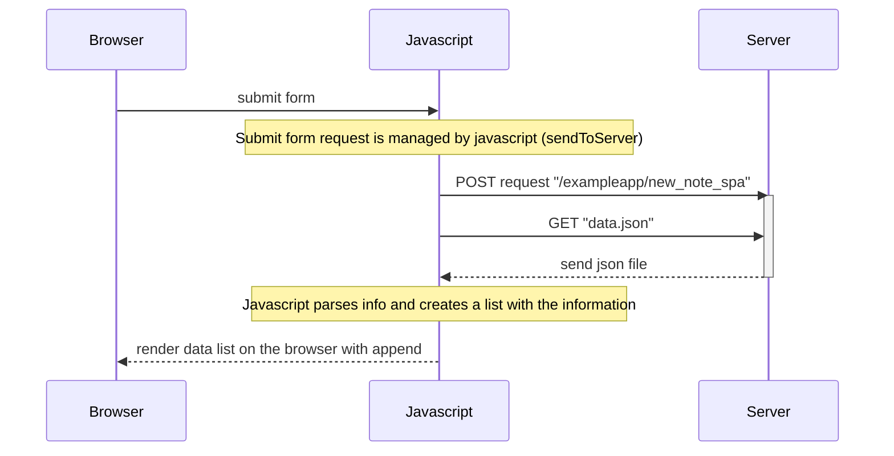

#New note spa

```mermaid
    sequenceDiagram

    participant b as Browser
    participant j as Javascript
    participant s as Server

    b ->> j: submit form
    Note over j: Submit form request is managed by javascript (sendToServer)

    j ->> s: POST request "/exampleapp/new_note_spa"
    activate s
    j ->> s: GET "data.json"
    s -->> j: send json file
    deactivate s


    Note over j: Javascript parses info and creates a list with the information
    j -->> b: render data list on the browser with append


```