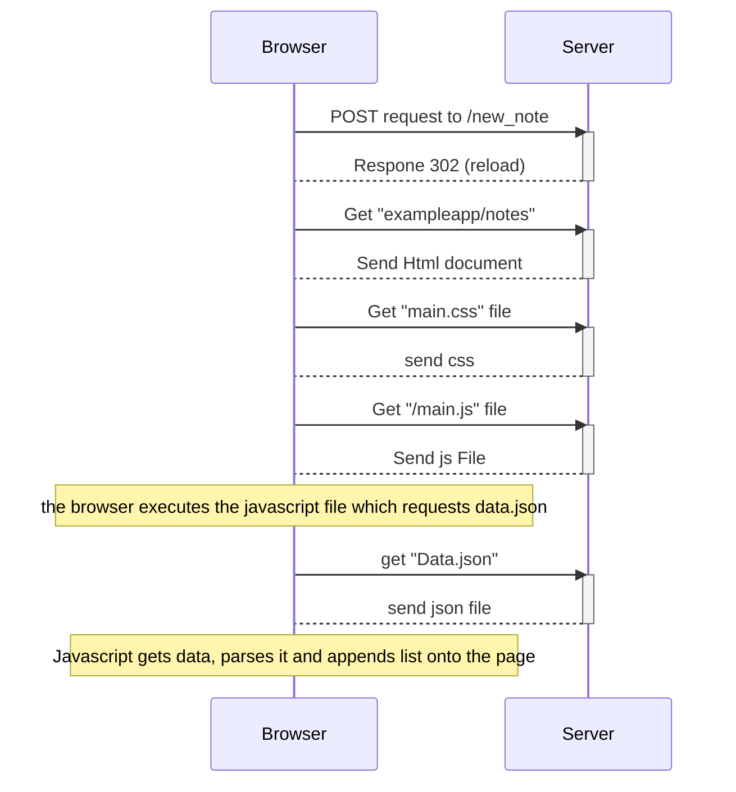

# new note diagram

```mermaid
sequenceDiagram

    participant Browser
    participant Server

    Browser ->> Server: POST request to /new_note
    activate Server
    Server --> Browser: Respone 302 (reload)
    deactivate Server

    Browser ->> Server: Get "exampleapp/notes"
    activate Server
    Server --> Browser: Send Html document
    deactivate Server

    Browser ->> Server: Get "main.css" file
    activate Server
    Server --> Browser: send css
    deactivate Server


    Browser ->> Server: Get "/main.js" file
    activate Server
    Server -->  Browser: Send js File
    deactivate Server

    Note over Browser: the browser executes the javascript file which requests data.json

    Browser ->> Server: get "Data.json"
    activate Server
    Server --> Browser: send json file
    deactivate Server
    
    Note over Browser: Javascript gets data, parses it and appends list onto the page
    
```